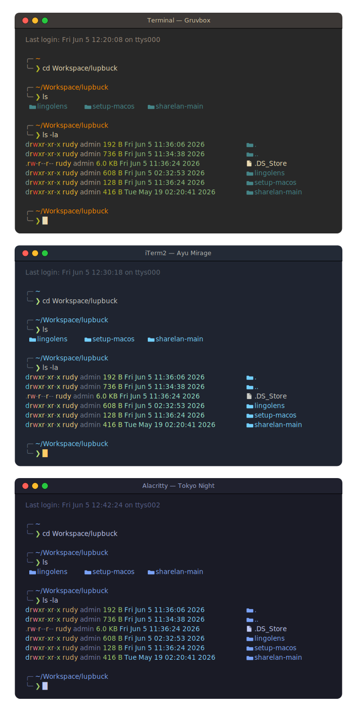

# Terminal Setup (macOS)

Idempotent script that sets up a unified terminal environment on macOS: it installs the tools and applies a consistent theme across all three terminals.


## What it installs (via Homebrew)

| Package | Type | Purpose |
|---|---|---|
| **Alacritty** | cask | Terminal emulator |
| **iTerm2** | cask | Terminal emulator |
| **JetBrainsMono Nerd Font** | cask | Font shared by all three terminals |
| **lsd** | formula | Modern `ls` replacement (with icons) |
| **Starship** | formula | Shell prompt |
| **zsh-syntax-highlighting** | formula | Syntax highlighting for zsh |

If **Homebrew** isn't present, it installs that too. If the **Xcode Command Line Tools** are missing, it offers to install them (required by Homebrew and to configure Terminal.app).

## What it configures

- **Themes:** Tokyo Night (Alacritty), Ayu Mirage (iTerm2), and Gruvbox (Terminal.app).
- **Prompt path color:** in Terminal.app (Gruvbox) the path shows in orange; Alacritty and iTerm2 keep the palette-adaptive blue. This uses a Gruvbox-specific Starship config (`starship-gruvbox.toml`) selected by `~/.zshrc` only when `$TERM_PROGRAM` is `Apple_Terminal`. Terminal.app supports only 256 colors (no 24-bit truecolor), so the orange is xterm-256 color `208` (~`#ff8700`) rather than a hex value, which it would ignore.
- The files `alacritty.toml`, `starship.toml`, `lsd` icons (`~/.config/lsd/icons.yaml`), and a managed block in `~/.zshrc`.
- **Working directory:** new tabs/windows reuse the current directory, while a fresh, independent launch starts at `~` (details below).

Any modified file is backed up to `~/.terminal-setup-backups/`.

## Usage

```bash
chmod +x setup-terminals.sh
./setup-terminals.sh
```

Options: `-h, --help` · `-v, --version` · `--no-color`.

## First run (important)

On a fresh machine you'll likely run the script from **Terminal.app**, since Alacritty and iTerm2 aren't installed yet. That's fine — the installation and every config file are applied correctly no matter which terminal you launch it from.

The one caveat is the **Terminal.app (Gruvbox) theme**. macOS keeps an app's preferences in memory while it's running and writes them back to disk on quit, so the Gruvbox profile can be overwritten when you later close Terminal.app. (The script warns you about this: *"Terminal.app is running; close it so the profile persists."*)

To make the Terminal.app theme stick, run it in two passes:

1. **First pass — from Terminal.app:** installs everything and writes all configs.
2. **Second pass — from Alacritty or iTerm2** (now installed): re-run the script. Since it's idempotent this is quick, and with Terminal.app closed its profile is written and persists.

The Alacritty and iTerm2 themes are not affected by this: Alacritty's config is a plain `.toml`, and iTerm2's is a dynamic profile in its own file that iTerm2 reads at launch and never overwrites.

## Preview



The same shell session in all three terminals: one shared font, a theme per terminal, and the prompt path in Gruvbox orange on Terminal.app vs the palette-adaptive blue on iTerm2 and Alacritty.

## Keeping the current directory in new tabs & windows

The goal: opening a new tab/window **from an existing session** keeps its directory (e.g. `/var/www/hola`), but launching a **fresh, independent session** starts at home (`~`).

| Terminal | New tab / window from a session | Fresh launch |
|---|---|---|
| **Alacritty** | ⌘N opens a new window in the current directory¹ | starts at `~` (set via `working_directory`) |
| **iTerm2** | new tabs, windows & split panes reuse the current directory | starts at `~` |
| **Terminal.app** | new **tabs** reuse the current directory by default | starts at `~` |

¹ Alacritty has no tabs — ⌘N opens a new window. It inherits the current shell's directory even though `working_directory` is set, so fresh launches land at home while ⌘N follows you.

**One manual step for Terminal.app windows:** new *tabs* already inherit the directory, but new *windows* open at home unless you turn it on once — **Terminal → Settings → General → "New windows open with: Same Working Directory."** (It's a global Terminal preference, so the script doesn't set it for you.) With it on, a new window from a session inherits that directory while a fresh launch still starts at home.

> The "reuse" behavior reads the **live** session's directory at the moment you open the new tab/window — it isn't saved to disk, so a brand-new launch never reopens in a stale directory. Directory reuse tracks **local** sessions automatically; over SSH you'd need each tool's shell integration for the remote directory to carry over. (Separately, if window restoration is enabled in iTerm2 or via macOS "reopen windows", restored windows return to their old directories — that's unrelated to this setting.)
